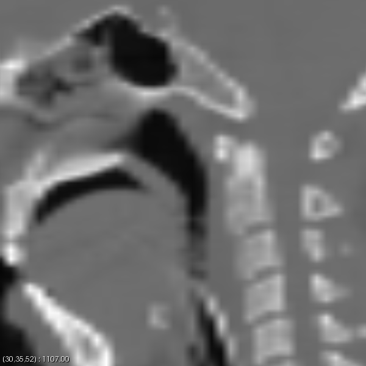
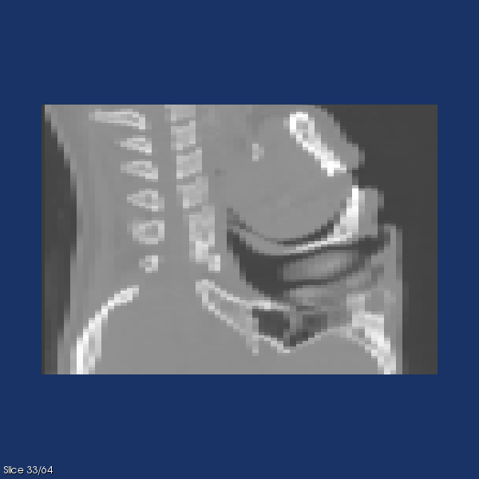
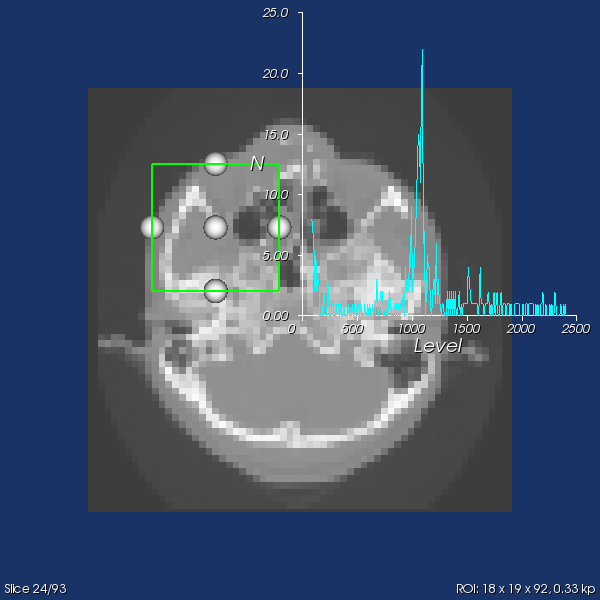
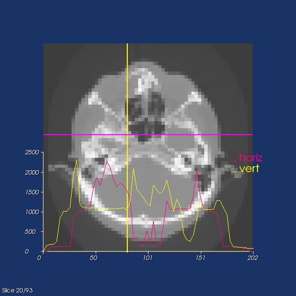

# CILViewer Documentation

## Using the 2D and 3D Viewers keyboard interactors

### **2D Viewer keybindings**
The interactive viewer CILViewer2D provides:
  - Keyboard Interactions:
    - 'h' display the help
    - 'x' slices on the YZ plane
    - 'y' slices on the XZ plane
    - 'z' slices on the XY
    - 'a' auto window/level to accomodate all values
    - 's' save render to PNG (current_render.png)
    - 'l' plots horizontal and vertical profiles of the displayed image at the pointer location
    - 'i' toggles interpolation
  - slice up/down: mouse scroll (10 x pressing SHIFT)
  - Window/Level: ALT + Right Mouse Button + drag
  - Pan: CTRL + Right Mouse Button + drag
  - Zoom: SHIFT + Right Mouse Button + drag (up: zoom in, down: zoom out)
  - Pick: Left Mouse Click
  - ROI (square): 
    - Create ROI: CTRL + Left Mouse Button 
    - Resize ROI: Left Mouse Button on outline + drag
    - Translate ROI: Middle Mouse Button within ROI
    - Delete ROI: ALT + Left Mouse Button

### Demonstration on head dataset[1]

| 2D viewer	| Zoom 	| Slice X + Pick 	|
|-----	|---	|---	|
||||

| ROI | Line profiles |
|---	|---	|
|||

### **3D Viewer keybindings**
The interactive 3D viewer CILViewer provides:
  - Keyboard Interactions:
    - 'h' display the help
    - 'x' slices on the YZ plane
    - 'y' slices on the XZ plane
    - 'z' slices on the XY
    - 'r' save render to current_render.png
    - 's' toggle visibility of slice
    - 'v' toggle visibility of volume render
    - 'c' activates volume render clipping plane widget, for slicing through a volume.
    - 'a' whole image Auto Window/Level on the slice.
    - 'i' interpolation of the slice.
  - Slice: Mouse Scroll
  - Zoom: Right Mouse + Move Up/Down
  - Pan: Middle Mouse Button + Move or Shift + Left Mouse + Move
  - Adjust Camera: Left Mouse + Move
  - Rotate: Ctrl + Left Mouse + Move

## References

[1] The head dataset is avaiable in [CIL-Data as 'head.mha'](https://github.com/TomographicImaging/CIL-Data) along with its license.