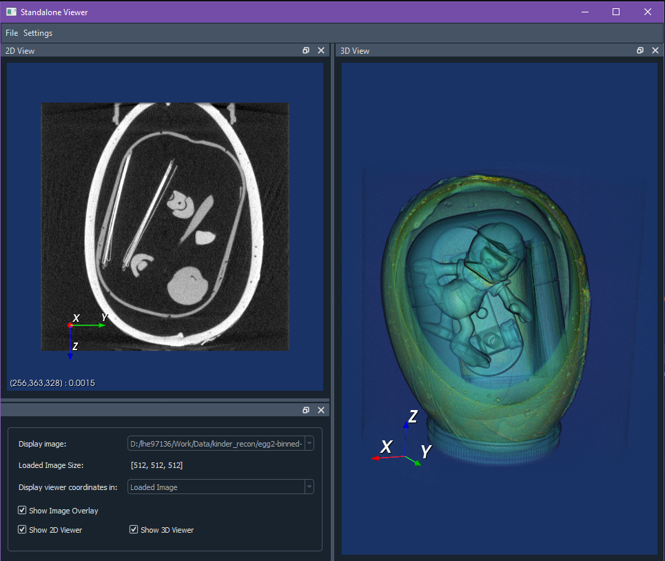
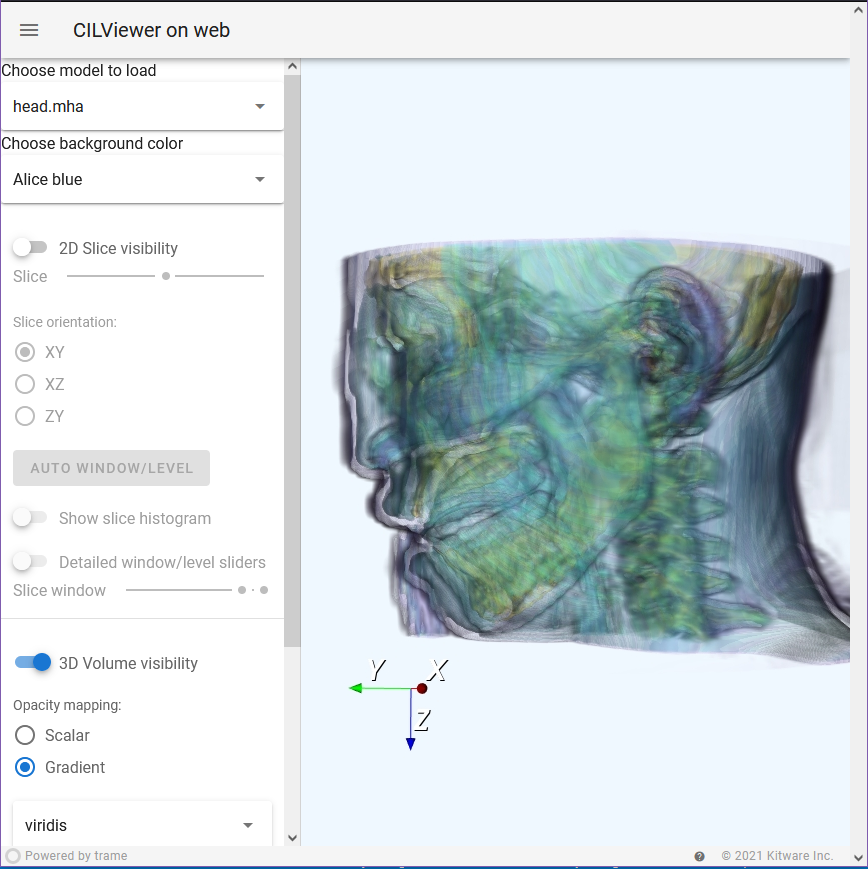
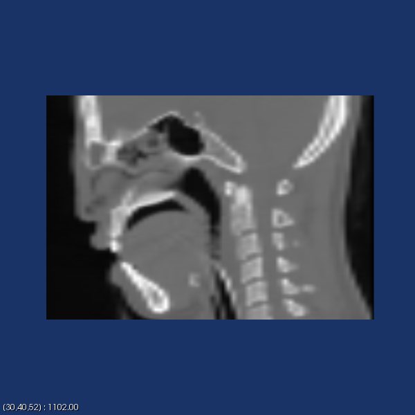
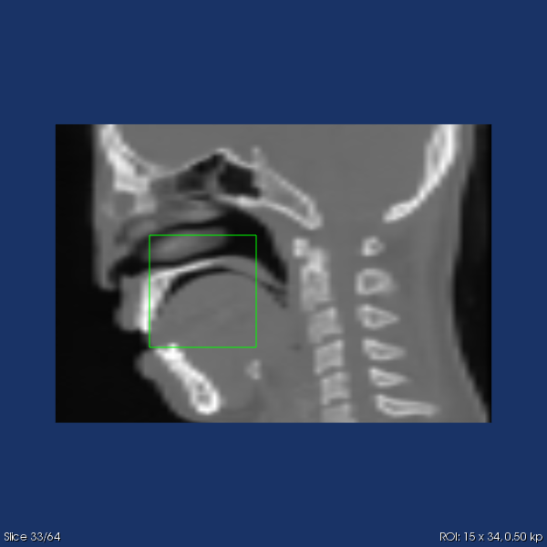
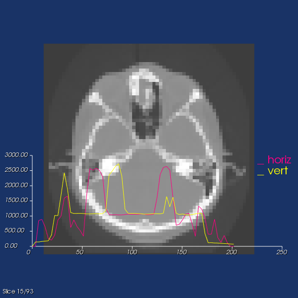

| Master | Development | Anaconda binaries |
|--------|-------------|-------------------|
| [](https://anvil.softeng-support.ac.uk/jenkins/job/CILsingle/job/CCPi-Viewer/) | [](https://anvil.softeng-support.ac.uk/jenkins/job/CILsingle/job/CCPi-Viewer-dev/) |  [ ](https://anaconda.org/ccpi/ccpi-viewer) |

# CILViewer
A simple Viewer for 3D data built with VTK and Python.
There are two versions:
- GUI built with Python Qt
- Web viewer, built with trame

The viewers can also be embedded into any Qt application.
An example of use of the viewers in another app is the [iDVC app](https://github.com/TomographicImaging/iDVC)

## Install instructions
To install via `conda`, create a new environment using:
<!-- VERSION_MARKER -->
```bash
conda create --name cilviewer ccpi-viewer=24.0.1 -c ccpi -c conda-forge
```
<!-- VERSION_MARKER -->


## Running the CILViewer app

- Activate your environment using: ``conda activate cilviewer``.
- Launch by typing: `cilviewer`
- Load a dataset using the File menu. Currently supported data formats:
  - HDF5, including Nexus
  - Raw
  - Tiff
  - Numpy
  - Metaimage (mha and mhd)



## Web viewer
See [here](https://github.com/vais-ral/CILViewer/tree/master/Wrappers/Python/ccpi/web_viewer) for instructions on how to install and run the web viewer.



## Using the 2D and 3D Viewers

### **2D Viewer**
### Keybindings
The interactive viewer CILViewer2D provides:
  - Keyboard Interactions:
    - 'h' display the help
    - 'x' slices on the YZ plane
    - 'y' slices on the XZ plane
    - 'z' slices on the XY
    - 'a' auto window/level to accomodate all values
    - 's' save render to PNG (current_render.png)
    - 'l' plots horizontal and vertical profiles of the displayed image at the pointer location
    - 'i' toggles interpolation
  - slice up/down: mouse scroll (10 x pressing SHIFT)
  - Window/Level: ALT + Right Mouse Button + drag
  - Pan: CTRL + Right Mouse Button + drag
  - Zoom: SHIFT + Right Mouse Button + drag (up: zoom in, down: zoom out)
  - Pick: Left Mouse Click
  - ROI (square): 
    - Create ROI: CTRL + Left Mouse Button 
    - Resize ROI: Left Mouse Button on outline + drag
    - Translate ROI: Middle Mouse Button within ROI
    - Delete ROI: ALT + Left Mouse Button

### Examples

| Head Dataset	| Zoom 	| Slice X + Pick 	|
|-----	|---	|---	|
||||

| ROI | Line profiles |
|---	|---	|
|||

### **3D Viewer**
### Keybindings
The interactive 3D viewer CILViewer provides:
  - Keyboard Interactions:
    - 'h' display the help
    - 'x' slices on the YZ plane
    - 'y' slices on the XZ plane
    - 'z' slices on the XY
    - 'r' save render to current_render.png
    - 's' toggle visibility of slice
    - 'v' toggle visibility of volume render
    - 'c' activates volume render clipping plane widget, for slicing through a volume.
    - 'a' whole image Auto Window/Level on the slice.
    - 'i' interpolation of the slice.
  - Slice: Mouse Scroll
  - Zoom: Right Mouse + Move Up/Down
  - Pan: Middle Mouse Button + Move or Shift + Left Mouse + Move
  - Adjust Camera: Left Mouse + Move
  - Rotate: Ctrl + Left Mouse + Move

## References
The chocolate egg dataset shown in above examples is dataset `egg2`:

Jakob Sauer Jørgensen, Martin Skovgaard Andersen, & Carsten Gundlach. (2021). HDTomo TXRM micro-CT datasets [Data set]. Zenodo. https://doi.org/10.5281/zenodo.4822516

The head dataset is avaiable in [CIL-Data as 'head.mha'](https://github.com/TomographicImaging/CIL-Data) along with its license.

## Developer Contribution Guide
See [CONTRIBUTING.md](./CONTRIBUTING.md).

## Notice
The CIL Viewer code took initial inspiration from a previous project of Edoardo Pasca and Lukas Batteau [PyVE](https://sourceforge.net/p/pyve/code/ci/master/tree/PyVE/), the license of which we report here:

```
Copyright (c) 2012, Edoardo Pasca and Lukas Batteau
All rights reserved.

Redistribution and use in source and binary forms, with or without modification, 
are permitted provided that the following conditions are met:

* Redistributions of source code must retain the above copyright notice, this list
of conditions and the following disclaimer.

* Redistributions in binary form must reproduce the above copyright notice, this 
list of conditions and the following disclaimer in the documentation and/or other
materials provided with the distribution.

* Neither the name of Edoardo Pasca or Lukas Batteau nor the names of any 
contributors may be used to endorse or promote products derived from this 
software without specific prior written permission.

THIS SOFTWARE IS PROVIDED BY THE COPYRIGHT HOLDERS AND CONTRIBUTORS "AS IS" AND ANY
EXPRESS OR IMPLIED WARRANTIES, INCLUDING, BUT NOT LIMITED TO, THE IMPLIED WARRANTIES
OF MERCHANTABILITY AND FITNESS FOR A PARTICULAR PURPOSE ARE DISCLAIMED. IN NO EVENT 
SHALL THE COPYRIGHT HOLDER OR CONTRIBUTORS BE LIABLE FOR ANY DIRECT, INDIRECT, 
INCIDENTAL, SPECIAL, EXEMPLARY, OR CONSEQUENTIAL DAMAGES (INCLUDING, BUT NOT LIMITED 
TO, PROCUREMENT OF SUBSTITUTE GOODS OR SERVICES; LOSS OF USE, DATA, OR PROFITS; OR 
BUSINESS INTERRUPTION) HOWEVER CAUSED AND ON ANY THEORY OF LIABILITY, WHETHER IN 
CONTRACT, STRICT LIABILITY, OR TORT (INCLUDING NEGLIGENCE OR OTHERWISE) ARISING IN
ANY WAY OUT OF THE USE OF THIS SOFTWARE, EVEN IF ADVISED OF THE POSSIBILITY OF SUCH DAMAGE.
```


